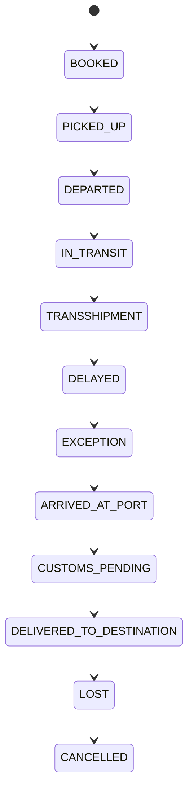
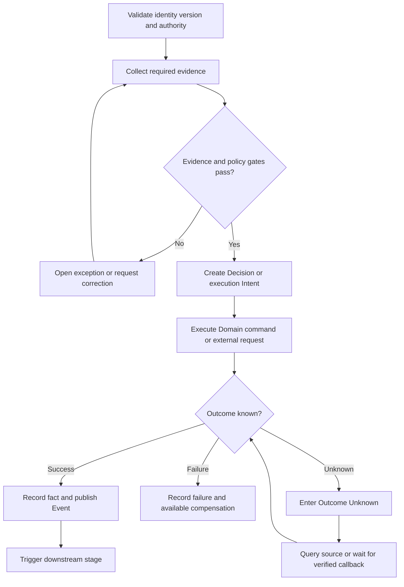

# Publication Chapter 20 — International Transport, Tracking, and Exceptions

| Metadata | Value |
|---|---|
| Publication Chapter | `20` |
| Canonical Lifecycle Stage | `19` |
| Status | Generated First-Draft Architecture Skeleton - Domain-Specific Expansion Required |
| Content maturity | `TEMPLATE_DERIVED_REFERENCE_SKELETON` unless repository citations prove otherwise |
| Default implementation classification | `REFERENCE_ARCHITECTURE` with explicit repository notes |
| Accountable capability | Shipping / Provider / external carrier |
| Canon dependencies | CANON-001 through CANON-011 |
| Constitutional dependencies | ART-001 through ART-016 |
| Evidence rule | No implementation claim without inspected executable evidence |
| Repository | `chinair88-prog/allinb2c` |

---

## 1. Executive Orientation

This stage exists to **assemble a qualified transport perspective from provider observations while preserving source, confidence, contradictions, corrections, and route-leg ownership**.

Its output is not merely a screen state or document download. It is a governed set of identified subjects, Relationships, Decisions, Intent, Commands, completed facts, external observations, evidence, and correction history.

```text
Reality or external outcome
    ≠ platform Observation
    ≠ derived Perspective
    ≠ AI Prediction
    ≠ Recommendation
    ≠ authorized Decision
    ≠ execution Intent
```

### 1.1 Accountability

The accountable capability is **Shipping / Provider / external carrier**. Supporting Portals, workflow engines, reports, search indexes, integration adapters, and AI Agents may coordinate or present the work, but they do not silently become owners of the underlying business truth.

### 1.2 Primary business outcomes

- a stable subject identity and exact source-version lineage;
- explicit authority and effective mandate;
- a testable lifecycle outcome;
- evidence sufficient for downstream use and later reconstruction;
- visible failure, partial completion, uncertainty, and correction;
- a completed-fact Event or qualified external observation;
- downstream activation without shared-database ownership transfer.

### 1.3 Non-goals

- treating a registered module as proof of complete implementation;
- treating a frontend route as proof of backend behavior;
- allowing an AI recommendation to become a binding Decision;
- inventing external-provider or government-authority success;
- overwriting history during amendment or correction;
- combining unrelated states into one generic `status` field.

---

## 2. Entry and Exit Criteria

### 2.1 Entry criteria

1. Every upstream subject reference resolves to a stable identifier.
2. The exact approved, accepted, issued, or observed version is known.
3. The initiating human, service, organization, or AI Agent is authenticated.
4. The represented principal and mandate are valid at command time.
5. Required Evidence exists, or an explicit authorized exception is linked.
6. Applicable Policy and jurisdiction versions are fixed.
7. Duplicate, stale-version, and replay checks have run.
8. Any conflicting active process is resolved, suspended, or explicitly related.

### 2.2 Exit criteria

1. The authoritative Domain or external authority records the outcome.
2. State and version changes are durable.
3. A completed-fact Event or qualified observation is available.
4. Downstream consumers receive stable subject, correlation, and causation references.
5. Unknown, partial, disputed, or failed outcomes remain visible.
6. Corrections preserve the original record and reason.
7. Metrics, audit evidence, and operational signals are emitted.
8. A qualified reviewer can reconstruct who knew what, when, and why.

---

## 3. Ubiquitous Language and Subject Model

Primary subject families:

| Subject | Required interpretation |
|---|---|
| `Shipment` | independent identified subject or governed subordinate entity; ownership must be declared |
| `ShipmentLeg` | independent identified subject or governed subordinate entity; ownership must be declared |
| `TransportMilestone` | independent identified subject or governed subordinate entity; ownership must be declared |
| `TrackingObservation` | independent identified subject or governed subordinate entity; ownership must be declared |
| `EstimatedArrival` | independent identified subject or governed subordinate entity; ownership must be declared |
| `TransportException` | independent identified subject or governed subordinate entity; ownership must be declared |
| `RouteDeviation` | independent identified subject or governed subordinate entity; ownership must be declared |
| `TrackingCorrection` | independent identified subject or governed subordinate entity; ownership must be declared |

Reference aggregate:

```text
Shipment {
  aggregateId
  tenantId
  organizationContext
  canonicalSubjectRefs[]
  sourceVersionRefs[]
  lifecycleState
  decisionRefs[]
  intentRefs[]
  evidenceSetRef
  knowledgeCutoff
  policyRefs[]
  authorityRef
  jurisdictionRefs[]
  createdAt
  effectiveAt
  updatedAt
  version
  correctionOf?
  correlationId
}
```

### 3.1 Identity and relationship rules

- a display name, document number, provider reference, barcode, or URL is not automatically canonical identity;
- relationships such as custody, mandate, allocation, publication, reservation, or obligation are independent facts;
- cross-Domain references use stable IDs and qualified snapshots, not shared-table mutation;
- external identifiers retain issuer and namespace;
- merge, split, correction, and supersession preserve lineage.

### 3.2 Invariants

1. Submitted, approved, accepted, issued, or signed versions are immutable.
2. State changes occur through authorized Commands.
3. Completed-fact Events use past-tense semantics.
4. A Recommendation cannot self-promote to a Decision.
5. An external outcome retains its source authority.
6. Derived projections cannot become authoritative by repeated copying.
7. All writes are tenant-, organization-, facility-, and authority-scoped as applicable.
8. Retried writes are idempotent.
9. Outcome Unknown is not converted to success or failure by assumption.
10. Corrections reference the corrected fact and downstream impact.

---

## 4. Lifecycle State Model

### 4.1 State vocabulary

| State | Meaning |
|---|---|
| `BOOKED` | distinct governed condition; exact entry, exit, timeout, and correction semantics require a Domain specification |
| `PICKED_UP` | distinct governed condition; exact entry, exit, timeout, and correction semantics require a Domain specification |
| `DEPARTED` | distinct governed condition; exact entry, exit, timeout, and correction semantics require a Domain specification |
| `IN_TRANSIT` | distinct governed condition; exact entry, exit, timeout, and correction semantics require a Domain specification |
| `TRANSSHIPMENT` | distinct governed condition; exact entry, exit, timeout, and correction semantics require a Domain specification |
| `DELAYED` | distinct governed condition; exact entry, exit, timeout, and correction semantics require a Domain specification |
| `EXCEPTION` | distinct governed condition; exact entry, exit, timeout, and correction semantics require a Domain specification |
| `ARRIVED_AT_PORT` | distinct governed condition; exact entry, exit, timeout, and correction semantics require a Domain specification |
| `CUSTOMS_PENDING` | distinct governed condition; exact entry, exit, timeout, and correction semantics require a Domain specification |
| `DELIVERED_TO_DESTINATION` | distinct governed condition; exact entry, exit, timeout, and correction semantics require a Domain specification |
| `LOST` | distinct governed condition; exact entry, exit, timeout, and correction semantics require a Domain specification |
| `CANCELLED` | distinct governed condition; exact entry, exit, timeout, and correction semantics require a Domain specification |

### 4.2 Reference state machine



The diagram shows a readable primary path. A conformant implementation may include parallel approvals, amendment, suspension, timeout, appeal, rejection, partial completion, reconciliation, and correction paths, but it must preserve the same semantic distinctions.

### 4.3 Transition matrix

| From | To | Minimum guard |
|---|---|---|
| `BOOKED` | `PICKED_UP` | authorized Command, expected version, applicable Policy, required Evidence, and idempotency guard |
| `PICKED_UP` | `DEPARTED` | authorized Command, expected version, applicable Policy, required Evidence, and idempotency guard |
| `DEPARTED` | `IN_TRANSIT` | authorized Command, expected version, applicable Policy, required Evidence, and idempotency guard |
| `IN_TRANSIT` | `TRANSSHIPMENT` | authorized Command, expected version, applicable Policy, required Evidence, and idempotency guard |
| `TRANSSHIPMENT` | `DELAYED` | authorized Command, expected version, applicable Policy, required Evidence, and idempotency guard |
| `DELAYED` | `EXCEPTION` | authorized Command, expected version, applicable Policy, required Evidence, and idempotency guard |
| `EXCEPTION` | `ARRIVED_AT_PORT` | authorized Command, expected version, applicable Policy, required Evidence, and idempotency guard |
| `ARRIVED_AT_PORT` | `CUSTOMS_PENDING` | authorized Command, expected version, applicable Policy, required Evidence, and idempotency guard |
| `CUSTOMS_PENDING` | `DELIVERED_TO_DESTINATION` | authorized Command, expected version, applicable Policy, required Evidence, and idempotency guard |
| `DELIVERED_TO_DESTINATION` | `LOST` | authorized Command, expected version, applicable Policy, required Evidence, and idempotency guard |
| `LOST` | `CANCELLED` | authorized Command, expected version, applicable Policy, required Evidence, and idempotency guard |

### 4.4 Forbidden state behavior

- direct arbitrary assignment from a Portal request;
- using one status to represent lifecycle, approval, payment, document, provider, and dispute state simultaneously;
- deleting terminal history to reopen a process;
- inferring completion from elapsed time or an AI prediction;
- moving past a mandatory gate because a downstream system already acted.

---

## 5. Decision, Policy, and Authority

Material Decisions in this stage include readiness, eligibility, approval, exception, amendment, correction, and downstream activation decisions.

Reference Decision:

```text
Decision {
  decisionId
  decisionType
  subjectRef
  sourceVersionRefs[]
  knowledgeCutoff
  evidenceSetRef
  policyVersionRefs[]
  recommendationRefs[]
  principalId
  representedOrganizationId
  mandateRef
  rationale
  outcome
  decidedAt
  effectiveAt
  correctionOf?
}
```

### Decision rules

- the Decision references exact source versions;
- authority and delegation are evaluated at Decision time;
- a Policy version and jurisdiction context are recorded;
- mandatory-gate failure blocks progression unless a lawful exception exists;
- dissent, uncertainty, and missing Evidence remain visible;
- Decision correction does not erase the original Decision;
- AI may prepare a briefing, but cannot manufacture authority.

---

## 6. Evidence, Documents, and Knowledge Cutoff

Every binding or high-impact action requires an Evidence Set containing:

- evidence identity and integrity hash where required;
- issuing, observing, or signing party;
- observed time, received time, and effective-time interval;
- subject and source-version relationships;
- qualification, confidence, and limitations;
- contradiction, retraction, supersession, and correction links;
- jurisdiction, classification, retention, and residency;
- chain of custody for physical or high-integrity evidence;
- the knowledge cutoff used by the Decision.

A document is not automatically truth. It is an Artifact containing Claims. Its legal or operational effect depends on issuer, mandate, signature, version, applicable rules, and external authority.

---

## 7. Commands, Events, and Queries

### 7.1 Commands

- `RecordTrackingObservation`
- `QualifyTransportMilestone`
- `UpdateEstimatedArrival`
- `OpenTransportException`
- `CorrectTrackingObservation`
- `CloseTransportException`

Each Command shall contain an idempotency key, actor identity, represented principal, tenant and organization context, correlation ID, expected version where relevant, reason for privileged action, and exact target subject.

### 7.2 Events

- `ShipmentDeparted`
- `ShipmentMilestoneObserved`
- `ShipmentDelayed`
- `EstimatedArrivalChanged`
- `TransportExceptionOpened`
- `RouteDeviationObserved`
- `ShipmentArrived`

Events describe completed facts or explicitly qualified observations. A request, proposed action, timer, or prediction is not a completed-fact Event.

### 7.3 Queries and perspectives

- `GetShipment`
- `ListShipmentRecords`
- `GetShipmentTimeline`
- `GetShipmentEvidence`
- `GetShipmentDecisionPackage`
- `GetShipmentExceptions`
- `GetShipmentAuditTrail`
- `GetShipmentCurrentPerspective`

Every query response states data freshness, source cutoff, version, and whether values are authoritative, observed, derived, predicted, or disputed.

---

## 8. Workflow, Timeout, and Compensation



Required workflow behavior:

- durable process and correlation identity;
- persisted approvals and timers;
- bounded retries and retry budgets;
- idempotent command submission;
- safe restart after deployment or outage;
- compensation that records new Intent instead of deleting history;
- visible stalled, orphaned, and manually intervened processes;
- operator access to source responses and downstream impact;
- reconciliation before repeating an external financial, legal, or physical action.

---

## 9. Target API Contract

Reference surface:

```text
POST /api/v1/international_transport_tracking_and_exceptions/commands
GET  /api/v1/international_transport_tracking_and_exceptions/{id}
GET  /api/v1/international_transport_tracking_and_exceptions/{id}/timeline
GET  /api/v1/international_transport_tracking_and_exceptions/{id}/evidence
GET  /api/v1/international_transport_tracking_and_exceptions/{id}/decisions
POST /api/v1/international_transport_tracking_and_exceptions/{id}/exceptions
POST /api/v1/international_transport_tracking_and_exceptions/{id}/corrections
```

These are reference endpoints, not claims that the exact routes exist.

Contract requirements:

- typed request and response schemas;
- action-level authorization;
- trusted authentication context for tenant identity;
- idempotency for writes;
- optimistic concurrency or equivalent aggregate guard;
- RFC problem-details or governed equivalent;
- stable pagination and sorting;
- versioning and deprecation policy;
- trace, correlation, and causation propagation;
- explicit Outcome Unknown response when external completion is unresolved.

---

## 10. Target Persistence and Data Ownership

Reference table families:

| Table family | Purpose |
|---|---|
| `stage_aggregate` | authoritative lifecycle subject |
| `stage_version` | immutable approved/submitted/issued versions |
| `stage_decision` | binding Decisions and rationale |
| `stage_evidence_link` | evidence and provenance relationships |
| `stage_event_outbox` | transactional Event publication |
| `stage_idempotency` | duplicate-write protection |
| `stage_exception` | exception, claim, hold, or dispute |
| `stage_correction` | correction and supersession lineage |
| `stage_audit` | privileged action evidence |

Data rules:

- the owning service controls its schema and migrations;
- foreign keys stay inside an ownership boundary;
- cross-Domain relationships use stable IDs or contracts;
- effective-time and recorded-time are separate when needed;
- binding versions are immutable;
- indexes support tenant, owner, state, correlation, external reference, and effective time;
- retention, legal hold, privacy, residency, backup, and restore are documented;
- analytics, search, reports, and vector stores are projections.

---

## 11. Portal and Experience Architecture

Required Portal behavior:

- display exact version, owner, state, and last-updated time;
- distinguish authoritative, observed, derived, predicted, and disputed values;
- expose required action and authority;
- show loading, empty, partial, stale, error, timeout, Outcome Unknown, and permission-denied states;
- provide accessible keyboard and screen-reader behavior;
- handle locale, currency, units, dates, and RTL/LTR correctly;
- preserve evidence and download audit;
- never trust a browser-provided tenant header as authority;
- prevent double submission while still supporting safe retry;
- show correction and supersession history.

Operator surfaces additionally expose correlation, source responses, retry budget, replay status, compensation options, and affected downstream subjects.

---

## 12. AI Participation and Tool Governance

Permitted AI tasks:

- predict ETA
- detect delay and route deviation
- reconcile multi-source observations
- summarize transport exceptions

AI may also summarize evidence, detect gaps, recommend next actions, and draft human-readable explanations.

AI shall not:

- own or directly mutate Domain databases;
- fabricate external-provider, carrier, bank, customs, inspection, or delivery outcomes;
- grant itself permission or mandate;
- silently change an approved or issued version;
- suppress uncertainty, contradictions, policy failures, or human dissent;
- execute high-impact actions outside typed tools and approval policy;
- create shadow records for canonical subjects.

Reference automation:

| Task | Maximum default |
|---|---|
| extraction and classification | A2, automatic with reviewable evidence |
| anomaly detection and recommendation | A2/A3 according to risk |
| binding commercial, legal, financial, quality, or custody Decision | A0/A1, human authority required |
| external execution | typed tool, policy, approval, idempotency, and outcome observation |
| correction of authoritative truth | governed human-authorized workflow |

Every Agent Run records prompt/model/tool versions, context sources, policy evaluation, approvals, tool calls, structured outputs, uncertainty, final observed outcome, and recovery actions.

---

## 13. Security, Privacy, and Trust Boundaries

Minimum controls:

- authenticated human, service, organization, device, and AI identities;
- represented principal and effective mandate validation;
- least privilege, ABAC/ReBAC where appropriate, and separation of duties;
- tenant, organization, facility, channel, and jurisdiction isolation;
- integrity protection for binding documents and Evidence;
- external callback signature and replay verification;
- confidential handling of commercial, personal, financial, transport, and regulatory data;
- secret isolation and no sensitive values in logs or prompts;
- privileged-action audit and emergency-access review;
- threat models for impersonation, tampering, replay, confused deputy, fraud, exfiltration, and prompt injection.

---

## 14. Reliability, SLOs, and Operations

Reference objectives:

| SLI | Reference objective |
|---|---|
| authoritative read availability | 99.9% monthly unless a stricter tier applies |
| acknowledged command durability | no acknowledged write may be silently lost |
| Event publication | 99.9% within five minutes after committed fact |
| duplicate prevention | 100% for same tenant, Command class, and idempotency key |
| binding Decision audit completeness | 100% |
| stale-state detection | bounded by the business deadline of the stage |

Operational requirements include dashboards, alerts, runbooks, ownership, dependency health, retry budgets, DLQ/replay controls, Event outbox/inbox, workflow restart, reconciliation, capacity, backup/restore, incident command, and post-incident correction.

---

## 15. Failure Modes and Recovery

Representative failures:

- stale or wrong source version;
- duplicate submission or replay;
- external timeout after possible success;
- contradictory source observations;
- lost Event after committed state;
- approval or mandate revoked during execution;
- downstream action performed before a mandatory gate;
- partial completion across multiple subjects;
- evidence later retracted or corrected;
- tenant, facility, or jurisdiction mismatch.

Recovery principles:

1. Query the authoritative source before repeating an external action.
2. Preserve partial success.
3. Use compensating Intent instead of destructive history rewrite.
4. Publish correction Events when distributed facts change.
5. Quarantine high-impact ambiguity.
6. Escalate when authority or legal effect is unclear.
7. Record business impact, affected subjects, and final reconciliation.

---

## 16. Testing and Conformance

Required tests:

- aggregate invariant and transition tests;
- authorization, mandate, separation-of-duties, and tenant-isolation tests;
- idempotency and optimistic-concurrency tests;
- migration, constraint, index, and rollback tests;
- outbox/inbox, ordering, duplicate, replay, and DLQ tests;
- workflow restart, timeout, compensation, and manual-intervention tests;
- provider callback verification and Outcome Unknown tests;
- Portal E2E for success, partial, stale, denied, and error journeys;
- accessibility, locale, currency, unit, and RTL tests;
- security adversarial and data-exfiltration tests;
- AI evaluation, prompt-injection, policy-bypass, and unauthorized-tool tests;
- historical reconstruction and correction tests;
- performance, capacity, disaster-recovery, and operational exercise evidence.

---

## 17. Repository Review Boundary and Previously Inspected Evidence

- Shipping, provider, Event Bus, and WebSocket capabilities are registered.
- External provider adapters and topic contracts require per-file verification.

| Area | Classification for this chapter |
|---|---|
| Target aggregate, API, tables, state model, and workflow | `REFERENCE_ARCHITECTURE` |
| Registered supporting modules | `DOCUMENTATION_ONLY_CLAIM` until executable files are inspected |
| Concrete behavior already established in earlier repository-grounded chapters | retain the original classification and evidence |
| Exact integration paths not inspected for this stage | `REQUIRES_REPOSITORY_REVIEW` |
| External authority or provider outcome | qualified external observation, never platform-owned truth |

No statement in this chapter upgrades an implementation status merely because a module name, frontend route, README, plan, or database catalog entry exists.

---

## 18. Worked Scenario

An upstream governed commitment enters the stage with exact subject and version references. The initiating principal is authenticated, and its mandate is checked at command time. Evidence is gathered and evaluated against the applicable policy version and jurisdiction.

A recommendation may be produced, but an authorized Decision remains separate. The Domain accepts an idempotent Command and records state plus an outbox entry atomically. When an external party participates, a timeout creates `Outcome Unknown`; the workflow queries the external source or waits for a verified callback instead of repeating execution blindly.

On success or failure, the system records a completed fact, publishes a stable Event, updates downstream projections, and preserves source and knowledge cutoff. Later corrections append new facts and identify downstream impact rather than replacing history. AI assists through typed tools and cannot own the subject, grant authority, or invent an outcome.

---

## 19. Conformance Checklist

- [ ] Stable subject and version identities are explicit.
- [ ] Proposition ownership and external authority are named.
- [ ] Entry and exit criteria are testable.
- [ ] State, Recommendation, Decision, Intent, execution, and outcome remain distinct.
- [ ] Commands are authorized, version-guarded, and idempotent.
- [ ] Events describe completed facts.
- [ ] Evidence includes provenance, time, integrity, and correction links.
- [ ] Portals show freshness, uncertainty, and Outcome Unknown.
- [ ] AI uses typed tools and approved autonomy.
- [ ] Security, privacy, tenant, facility, and jurisdiction boundaries are enforced.
- [ ] Reconciliation precedes risky duplicate execution.
- [ ] Corrections preserve history.
- [ ] Tests prove invariants, security, failure, and recovery.
- [ ] Implementation status is not upgraded without executable repository evidence.

---

## 20. Status Vocabulary

- `VERIFIED_IMPLEMENTED`: executable source and the relevant behavior were inspected.
- `IMPLEMENTED_WITH_GAP`: executable behavior exists with a material governance or completeness gap.
- `PARTIAL_IMPLEMENTATION`: only part of the target capability is evidenced.
- `REFERENCE_ARCHITECTURE`: normative target behavior; no claim that it exists today.
- `PLANNED_NOT_IMPLEMENTED`: explicitly planned but not evidenced as executable.
- `DOCUMENTATION_ONLY_CLAIM`: documentation or a client contract claims behavior without verified backend evidence.
- `CONFLICT_REQUIRES_CANONICALIZATION`: sources disagree and no final owner has been established.
- `REQUIRES_REPOSITORY_REVIEW`: the necessary executable evidence has not yet been inspected.

