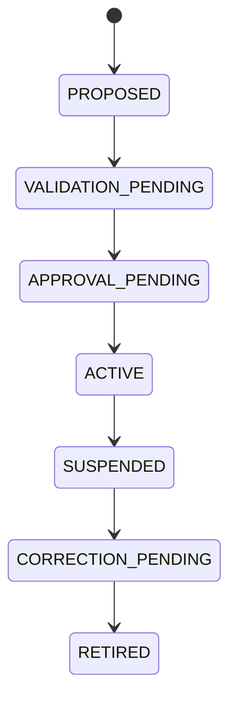
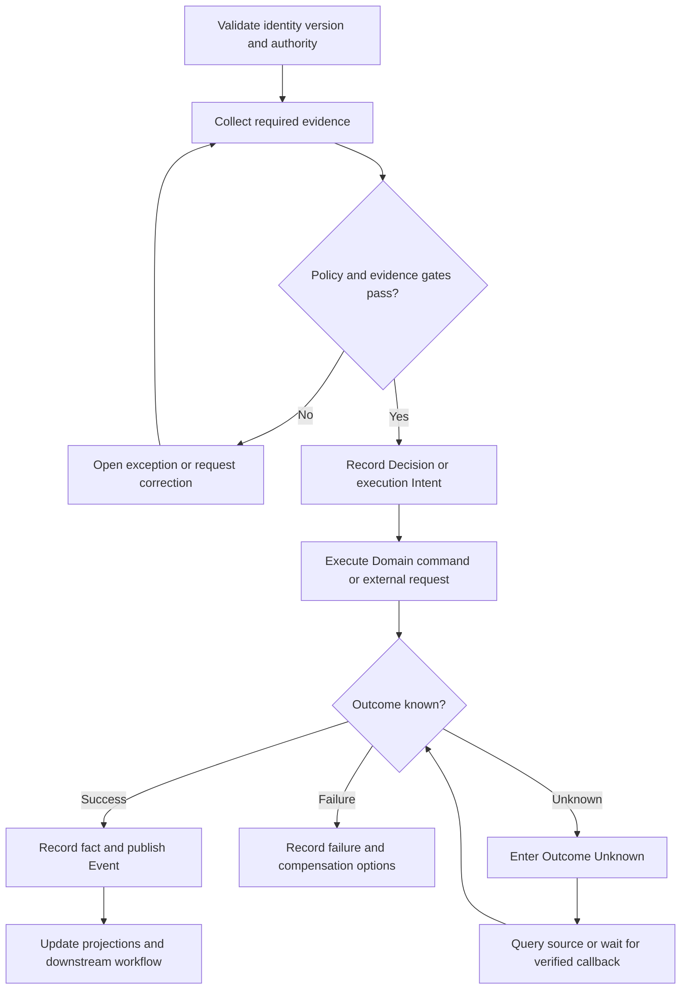

# Compatibility Adapters

| Metadata | Value |
|---|---|
| Volume | `18` |
| Chapter ID | `V18-11` |
| Subject | `CompatibilityAdapters` |
| Status | Generated First-Draft Architecture Skeleton - Domain-Specific Expansion Required |
| Content maturity | `TEMPLATE_DERIVED_REFERENCE_SKELETON` unless repository citations prove otherwise |
| Default implementation classification | `REFERENCE_ARCHITECTURE` / `REQUIRES_REPOSITORY_REVIEW` |
| Accountable owner | Evolution Council |
| Evidence rule | No implementation claim without inspected executable evidence |
| Repository | `chinair88-prog/allinb2c` |

---

## 1. Executive Orientation

This chapter defines how GTOS shall **define the target architecture, implementation standard, evidence, security, reliability, operations, tests, migration and conformance requirements for Compatibility Adapters**.

The specification separates reality, observations, knowledge, Decisions, Intent, execution, and outcomes. A component name, database row, UI label, AI answer, or workflow state does not acquire authority merely because it is visible or technically convenient.

```text
Reality or external outcome
    ≠ Observation
    ≠ Claim
    ≠ derived Perspective
    ≠ Prediction
    ≠ Recommendation
    ≠ authorized Decision
    ≠ execution Intent
```

### 1.1 Accountable ownership

The accountable owner is **Evolution Council**. Supporting applications, shared infrastructure, integration adapters, analytics, and AI coordinate or present the capability but shall not silently own its authoritative propositions.

### 1.2 Scope

- create and identify the subject
- validate evidence and policy
- make authorized Decisions
- execute typed Commands
- publish completed-fact Events
- query current and historical perspectives
- correct and reconcile outcomes

### 1.3 Non-goals

- treating a registered Gradle module, catalog record, README, frontend route, migration plan, or generated report as proof of end-to-end implementation;
- direct cross-Domain database writes;
- generic `status` values that combine lifecycle, approval, provider, document, payment, dispute, and correction state;
- silent replacement of history;
- AI-created authority or fabricated external outcomes.

---

## 2. Ubiquitous Language and Subject Model

| Subject | Required interpretation |
|---|---|
| `CompatibilityAdapters` | Independent identified subject, governed subordinate entity, or qualified perspective; ownership must be explicit |
| `CompatibilityAdaptersVersion` | Independent identified subject, governed subordinate entity, or qualified perspective; ownership must be explicit |
| `CompatibilityAdaptersDecision` | Independent identified subject, governed subordinate entity, or qualified perspective; ownership must be explicit |
| `CompatibilityAdaptersEvidenceSet` | Independent identified subject, governed subordinate entity, or qualified perspective; ownership must be explicit |
| `CompatibilityAdaptersException` | Independent identified subject, governed subordinate entity, or qualified perspective; ownership must be explicit |

Reference aggregate:

```text
CompatibilityAdapters {
  subjectId
  tenantId
  organizationContext
  sourceIdentityRefs[]
  sourceVersionRefs[]
  lifecycleState
  relationshipRefs[]
  decisionRefs[]
  intentRefs[]
  evidenceSetRef
  knowledgeCutoff
  policyRefs[]
  authorityRef
  jurisdictionRefs[]
  createdAt
  effectiveAt
  updatedAt
  version
  correctionOf?
  correlationId
}
```

### 2.1 Core invariants

- Stable identity precedes relationship, state, and cross-system correlation.
- Effective time and recorded time remain distinct where business truth changes over time.
- Recommendation, Decision, Intent, execution, and outcome are separate concepts.
- No Portal, report, search index, cache, workflow, or AI Agent becomes a shadow owner of Domain truth.
- Binding submitted, approved, issued, accepted, or signed versions are immutable.
- Corrections append governed facts and preserve the original record.
- External authority and provider outcomes retain their source and qualification.
- Tenant and represented-principal context come from trusted authentication and mandate evaluation.
- Retried writes are idempotent and concurrency guarded.
- Outcome Unknown is explicit and reconciled before risky duplicate execution.

### 2.2 Required standards

- stable identifiers
- typed contracts
- immutable binding versions
- transactional outbox
- idempotent Commands
- explicit Outcome Unknown
- correction lineage
- machine-verifiable conformance

---

## 3. Actors, Roles, and Authority

A conformant design distinguishes:

- the natural person acting;
- the service or AI identity invoking a Tool;
- the organization or principal represented;
- the role or relationship granting context;
- the mandate or delegation granting action authority;
- the Policy and jurisdiction limiting the action;
- the reviewer or approver responsible for a binding Decision.

Authority is evaluated at action time. Authentication alone does not grant business authority. Cached permissions and browser-supplied tenant headers are insufficient for high-impact actions.

---

## 4. Lifecycle and State Model

| State | Semantics |
|---|---|
| `PROPOSED` | Distinct governed condition with entry, exit, timeout, correction and authority semantics |
| `VALIDATION_PENDING` | Distinct governed condition with entry, exit, timeout, correction and authority semantics |
| `APPROVAL_PENDING` | Distinct governed condition with entry, exit, timeout, correction and authority semantics |
| `ACTIVE` | Distinct governed condition with entry, exit, timeout, correction and authority semantics |
| `SUSPENDED` | Distinct governed condition with entry, exit, timeout, correction and authority semantics |
| `CORRECTION_PENDING` | Distinct governed condition with entry, exit, timeout, correction and authority semantics |
| `RETIRED` | Distinct governed condition with entry, exit, timeout, correction and authority semantics |



The diagram is a primary reading path. Real implementations may add parallel review, amendment, appeal, timeout, suspension, partial completion, reconciliation, correction, and terminal failure without collapsing their meaning.

### 4.1 Transition rules

- transition through a typed, authorized Command;
- require exact expected version where concurrent change matters;
- record actor, represented principal, mandate, Policy, reason, and Evidence;
- use an idempotency key for retried writes;
- publish a completed-fact Event after durable state change;
- expose Outcome Unknown for unresolved external completion;
- preserve original and corrected states in historical reconstruction.

---

## 5. Decision, Evidence, and Knowledge Cutoff

Reference Decision:

```text
Decision {
  decisionId
  decisionType
  subjectRef
  sourceVersionRefs[]
  knowledgeCutoff
  evidenceSetRef
  policyVersionRefs[]
  recommendationRefs[]
  principalId
  representedOrganizationId
  mandateRef
  rationale
  outcome
  decidedAt
  effectiveAt
  correctionOf?
}
```

Evidence records identify issuer or observer, subject, version, observed time, received time, effective interval, integrity, confidence, qualification, contradiction, correction, retention, residency, and access class. A recommendation may assist the Decision but cannot promote itself to the Decision.

---

## 6. Commands, Events, Queries, and Contracts

Reference Commands:

- `CreateCompatibilityAdapters`
- `ValidateCompatibilityAdapters`
- `ApproveCompatibilityAdapters`
- `ActivateCompatibilityAdapters`
- `SuspendCompatibilityAdapters`
- `CorrectCompatibilityAdapters`
- `RetireCompatibilityAdapters`

Reference Events:

- `CompatibilityAdaptersCreated`
- `CompatibilityAdaptersValidated`
- `CompatibilityAdaptersApproved`
- `CompatibilityAdaptersActivated`
- `CompatibilityAdaptersSuspended`
- `CompatibilityAdaptersCorrected`
- `CompatibilityAdaptersRetired`

Reference queries:

- `GetCompatibilityAdapters`
- `ListCompatibilityAdaptersRecords`
- `GetCompatibilityAdaptersTimeline`
- `GetCompatibilityAdaptersEvidence`
- `GetCompatibilityAdaptersDecisionPackage`
- `GetCompatibilityAdaptersExceptions`
- `GetCompatibilityAdaptersAuditTrail`

Reference API surface:

```text
POST /api/v1/compatibilityadapters/commands
GET  /api/v1/compatibilityadapters/{id}
GET  /api/v1/compatibilityadapters/{id}/timeline
GET  /api/v1/compatibilityadapters/{id}/evidence
GET  /api/v1/compatibilityadapters/{id}/decisions
POST /api/v1/compatibilityadapters/{id}/exceptions
POST /api/v1/compatibilityadapters/{id}/corrections
```

These endpoints are reference contracts, not claims that exact routes exist.

---

## 7. Workflow, Failure, and Compensation



Representative failure modes:

- stale or wrong source version
- duplicate submission or replay
- external timeout after possible success
- contradictory source observations
- lost Event after committed state
- approval or mandate revoked during execution
- downstream action before a mandatory gate
- partial completion across multiple subjects
- evidence later retracted or corrected
- tenant, facility, channel or jurisdiction mismatch

Recovery shall query the authoritative source before duplicate execution, preserve partial success, use compensating Intent rather than destructive rewrite, publish corrections, quarantine high-impact ambiguity, and record affected downstream subjects.

---

## 8. Data and Persistence Architecture

Reference table families:

| Table family | Purpose |
|---|---|
| `compatibilityadapters_aggregate` | authoritative subject |
| `compatibilityadapters_version` | immutable submitted, approved, issued, or signed versions |
| `compatibilityadapters_relationship` | governed relationships |
| `compatibilityadapters_decision` | binding Decisions and rationale |
| `compatibilityadapters_evidence_link` | provenance and evidence relationships |
| `compatibilityadapters_event_outbox` | transactional Event publication |
| `compatibilityadapters_idempotency` | duplicate-write protection |
| `compatibilityadapters_exception` | exception, claim, dispute, or hold |
| `compatibilityadapters_correction` | correction and supersession lineage |
| `compatibilityadapters_audit` | privileged action evidence |

The owning service controls schema and migration. Cross-Domain references use stable identifiers or contracts. Analytics, reports, caches, search, and vector indexes remain projections. Backup, restore, retention, legal hold, privacy, residency, and decommissioning requirements are explicit.

---

## 9. Portal and Experience Requirements

- Primary participant Portal: initiate, review exact versions, supply evidence, and respond to required actions.
- Operator Portal: inspect exceptions, correlation, source responses, retries, compensation, and downstream impact.
- Executive or oversight view: consume governed metrics without becoming a source of Domain truth.

Every Portal displays exact version, owner, state, freshness, required action, and uncertainty. It supports loading, empty, partial, stale, denied, error, timeout, and Outcome Unknown states; accessibility; locale, currency, unit, date, and RTL/LTR correctness; evidence audit; safe retry; and correction history.

---

## 10. AI Participation and Tool Governance

Permitted AI tasks:

- extract and classify evidence
- detect anomalies and missing fields
- summarize timelines and contradictions
- recommend next actions with sources and uncertainty

AI shall not own Domain records, grant itself authority, suppress contradictions, silently edit approved versions, fabricate external outcomes, or execute high-impact actions outside typed Tools, policy, approval, idempotency, sandbox, and outcome observation.

Every Agent Run records source context, prompt/model/tool versions, structured output, confidence and limitations, Policy result, approval, Tool calls, provider responses, final outcome, and recovery actions.

---

## 11. Security, Privacy, and Trust Boundaries

- least privilege and separation of duties
- tenant, organization, facility, channel and jurisdiction isolation
- integrity protection for binding evidence
- verified external callbacks and anti-replay controls

Additional controls include secret isolation, callback signature verification, audit of privileged action, emergency-access review, sensitive-data minimization, purpose limitation, and threat models for impersonation, tampering, replay, confused deputy, fraud, prompt injection, and exfiltration.

---

## 12. Reliability, SLOs, and Operations

| SLI | Reference objective |
|---|---|
| authoritative read availability | 99.9% monthly unless a stricter tier applies |
| acknowledged Command durability | no acknowledged write may be silently lost |
| Event publication | 99.9% within five minutes after committed fact |
| duplicate prevention | 100% for same tenant, Command class, and idempotency key |
| binding Decision audit completeness | 100% |
| stale-state detection | bounded by business deadline |

Dashboards and runbooks cover backlog, error budget, dependency failure, retry budget, DLQ, workflow stall, provider outage, reconciliation, capacity, backup/restore, release/rollback, incident command, and post-incident correction.

---

## 13. Testing and Continuous Conformance

- aggregate invariant and transition tests
- authorization, delegation, separation-of-duties and tenant-isolation tests
- idempotency and optimistic-concurrency tests
- database migration, key, constraint and rollback tests
- contract, outbox/inbox, duplicate, replay and DLQ tests
- workflow restart, timeout and compensation tests
- Portal E2E tests for success, partial, stale, denied, error and Outcome Unknown states
- accessibility, locale, currency, unit and RTL/LTR tests
- security adversarial, fraud and data-exfiltration tests
- AI evaluation, prompt-injection, policy-bypass and unauthorized-tool tests
- historical reconstruction, correction and audit-completeness tests
- performance, capacity, recovery and operational exercise tests

Release evidence links each invariant and control to the test, environment, input data, result, owner, and artifact proving it. Generated test counts never replace semantic coverage.

---

## 14. Repository Review Boundary

- `Compatibility Adapters` is part of the target GTOS handbook scope.
- Exact implementation, configuration, deployment, tests and runtime evidence require repository and environment inspection.
- Plans and infrastructure manifests are classified separately from observed runtime behavior.

| Area | Classification |
|---|---|
| target aggregate, API, tables, state and workflow in this chapter | `REFERENCE_ARCHITECTURE` |
| registered module or catalog claim | `DOCUMENTATION_ONLY_CLAIM` until source inspection |
| uninspected integration | `REQUIRES_REPOSITORY_REVIEW` |
| behavior proven in another repository-grounded chapter | retain that chapter's evidence and classification |
| contradictory ownership or path claims | `CONFLICT_REQUIRES_CANONICALIZATION` |

No statement upgrades implementation status merely because a file, directory, module name, frontend contract, database entry, plan, or report exists.

---

## 15. Worked Conformance Scenario

An authorized principal initiates a Command against an exact subject version. The service validates identity, tenant, mandate, Policy, Evidence, and idempotency. It records the state transition and outbox entry atomically. If an external dependency participates, timeout produces Outcome Unknown; reconciliation queries the source or waits for a verified callback instead of repeating the action blindly.

Portals show source, freshness, version, required action, and uncertainty. AI may extract, compare, summarize, detect anomalies, and recommend through typed Tools, but cannot own the subject or fabricate success. Later correction appends new facts, identifies affected projections and workflows, and preserves the historical Decision context.

---

## 16. Conformance Checklist

- [ ] stable identity and proposition ownership are explicit;
- [ ] authority and mandate are evaluated at action time;
- [ ] state, Recommendation, Decision, Intent, execution, and outcome remain distinct;
- [ ] Commands are typed, authorized, idempotent, and version guarded;
- [ ] Events describe completed facts;
- [ ] Evidence includes provenance, time, integrity, qualification, and correction;
- [ ] external outcomes retain their authority source;
- [ ] Portals show freshness and uncertainty;
- [ ] AI is bounded by typed Tools, Policy, approval, and outcome observation;
- [ ] security, tenant, facility, channel, and jurisdiction boundaries are enforced;
- [ ] Outcome Unknown and reconciliation exist where needed;
- [ ] corrections preserve history;
- [ ] tests prove invariants and recovery;
- [ ] implementation status is not upgraded without executable evidence.

---

## 17. Status Vocabulary

| Status | Meaning |
|---|---|
| `VERIFIED_IMPLEMENTED` | Executable source and relevant behavior were inspected. |
| `IMPLEMENTED_WITH_GAP` | Executable behavior exists with a material governance or completeness gap. |
| `PARTIAL_IMPLEMENTATION` | Only part of the target capability is evidenced. |
| `REFERENCE_ARCHITECTURE` | Normative target behavior; no claim that it exists today. |
| `PLANNED_NOT_IMPLEMENTED` | Explicitly planned but not evidenced as executable. |
| `DOCUMENTATION_ONLY_CLAIM` | Documentation or client contract claims behavior without verified backend evidence. |
| `CONFLICT_REQUIRES_CANONICALIZATION` | Sources disagree and no final owner has been established. |
| `REQUIRES_REPOSITORY_REVIEW` | Necessary executable evidence has not yet been inspected. |
